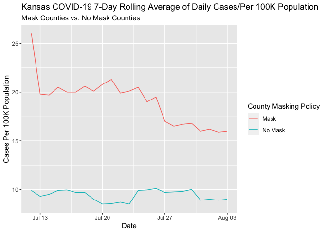

Lab 07 - Conveying the right message through visualisation
================
Lindsey Wilson
4/19/23

### Load packages and data

``` r
library(tidyverse) 
```

### Exercise 1

Below is my code to generate the data frame I need to create a less
misleading visualization:

``` r
date <- seq(as.Date("2020/7/12"), as.Date("2020/8/3"), by = "day")

mask <- c(26, 19.8, 19.7, 20.5, 20, 20, 20.6, 20.1, 20.8, 21.3, 19.9, 20.1, 20.5, 19, 19.5, 17, 16.5, 16.7, 16.8, 16, 16.2, 15.9, 16)

no_mask <- c(9.9, 9.3, 9.5, 9.9, 9.95, 9.7, 9.7, 9, 8.5, 8.55, 8.7, 8.5, 9.9, 9.95, 10.1, 9.7, 9.75, 9.8, 10, 8.9, 9, 8.9, 9)

replica <- data.frame(date, mask, no_mask)

replica_long <- replica %>%
  pivot_longer(cols = -date,
               names_to = "masking",
               values_to = "count")
```

### Exercise 2

And based on my data frame, here’s my updated (and not misleading)
visualization:

``` r
ggplot(data = replica_long,
       aes(x = date,
           y = count,
           color = masking)) +
  geom_line() +
  labs(title = "Kansas COVID-19 7-Day Rolling Average of Daily Cases/Per 100K Population",
       subtitle = "Mask Counties vs. No Mask Counties",
       x = "Date",
       y = "Cases Per 100K Population",
       color = "County Masking Policy") +
  scale_color_discrete(labels = c("Mask", "No Mask"))
```

<!-- -->

### Exercise 3

What’s clear in this visualization that isn’t in the original is that
the masked counties have substantially more cases
